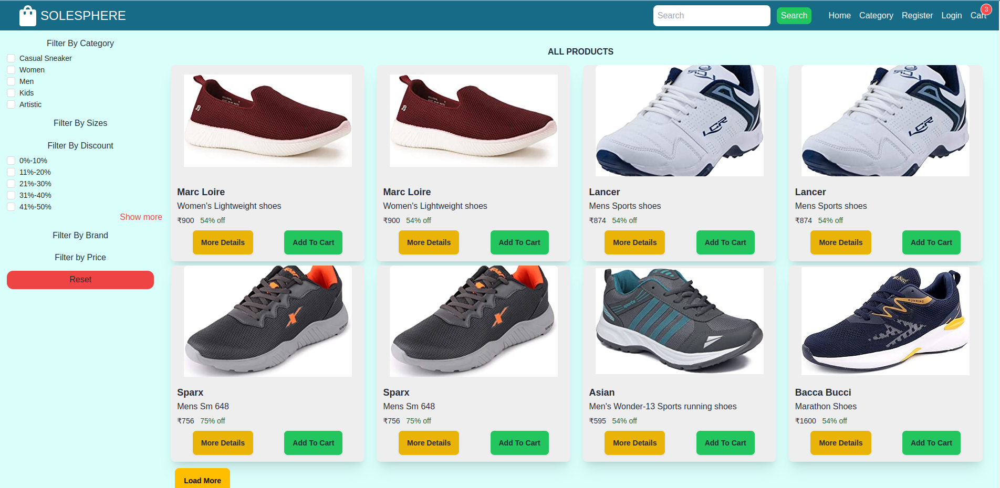
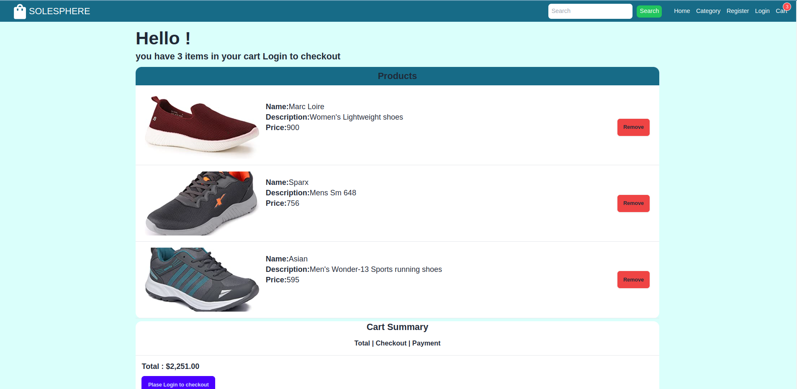
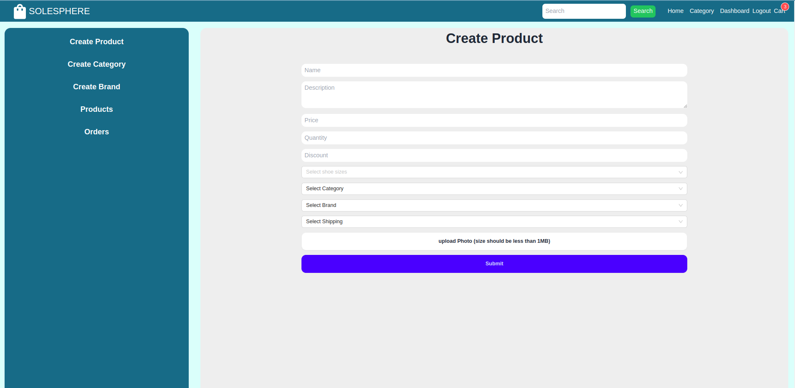
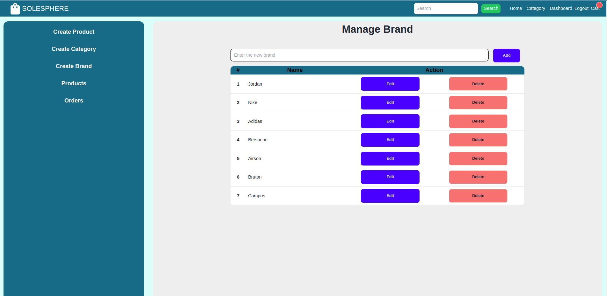
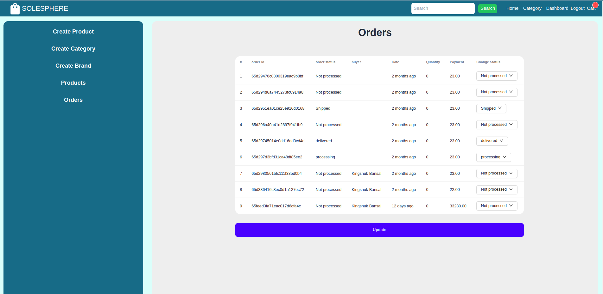

# SoleSphere

SoleSphere is a web application designed for buying shoes online. It offers a user-friendly interface and a range of features to enhance the shopping experience.

## Live Demo

Check out the live demo of SoleSphere at [SoleSphere Live Demo](https://sole-sphere-teal.vercel.app/).
## Access

- **Admin Dashboard**: 
  - **Email**: bansalkingshuk@gmail.com
  - **Password**: 123

## Features

- **Cart**: Users can add desired shoes to their cart for convenient checkout.
- **Filters**: Seamless filtering options enable users to narrow down their search based on various criteria such as size, category, brand, etc.
- **Search**: A robust search functionality allows users to quickly find specific shoes.
- **Admin Dashboard**: Administrators can manage inventory, track orders, and perform various administrative tasks through the dedicated dashboard.
- **Responsive Design**: The website is designed to be responsive, providing an optimal viewing experience across a wide range of devices, from mobile phones to desktop computers.

## Technologies Used

- React.js
- Node.js
- Express.js
- MongoDB
- Tailwind CSS

## Installation

To run this project locally, follow these steps:

1. Clone the repository.
2. Navigate to the project directory in your terminal.
3. Install dependencies by running `npm install` in both the client and server directories.
4. Start the server by running `npm start` in the server directory.
5. Start the client by running `npm start` in the client directory.
6. Access the application at `http://localhost:3000`.

## Screenshots

  
  
    

  

  

<!-- Add screenshots here -->

